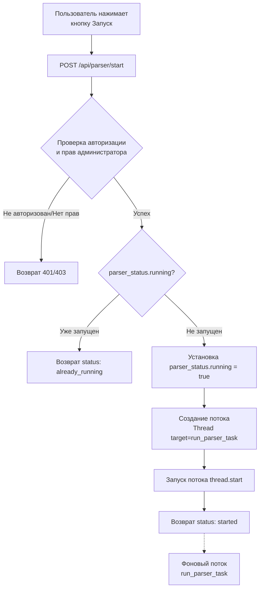
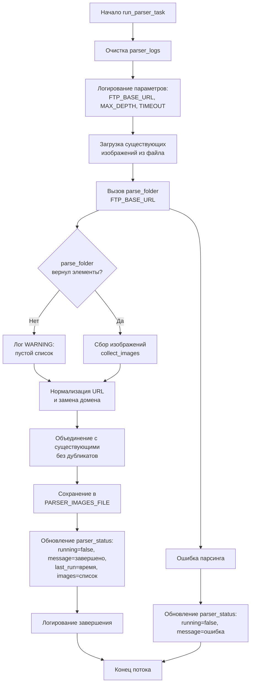
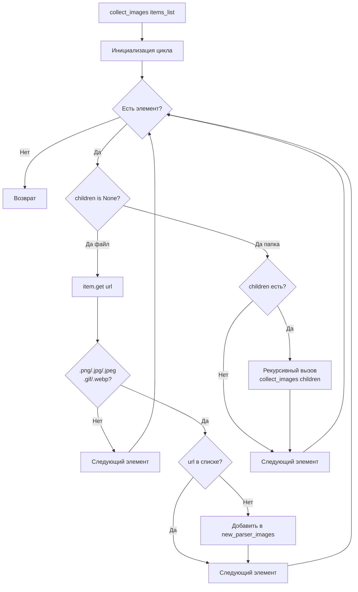
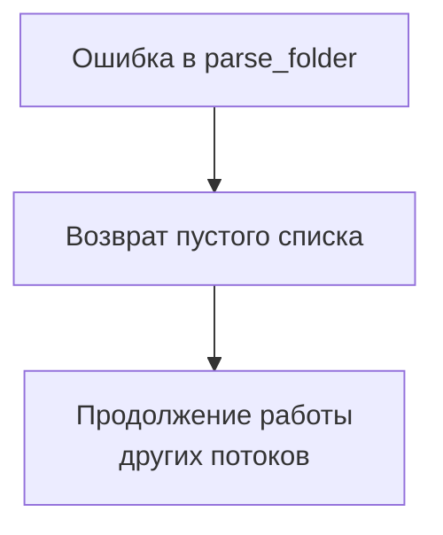

# Блок-схема парсера FTP-каталога

## Общая архитектура



## Детальная схема работы парсера (run_parser_task)



## Рекурсивный парсинг (parse_folder)

```mermaid
flowchart TD
    Start[parse_folder url, depth] --> CheckDepth{depth > max_depth?}
    CheckDepth -->|Да| ReturnEmpty1[Возврат []]
    CheckDepth -->|Нет| CheckVisited{url в visited?}
    CheckVisited -->|Да| ReturnEmpty2[Возврат []]
    CheckVisited -->|Нет| AddVisited[Добавить url в visited]
    
    AddVisited --> Sleep[Задержка REQUEST_DELAY<br/>2 секунды]
    Sleep --> HTTPRequest[requests.get url,<br/>timeout, verify=False]
    
    HTTPRequest --> HTTPError{HTTP ошибка?}
    HTTPError -->|Timeout| RaiseError1[raise Exception]
    HTTPError -->|ConnectionError| RaiseError2[raise Exception]
    HTTPError -->|OK status 200| ContinueParse
    
    RaiseError1 --> ReturnEmpty3[Возврат []]
    RaiseError2 --> ReturnEmpty3
    
    ContinueParse --> ExtractItems[extract_items_from_html<br/>response.text, url]
    
    ExtractItems --> FindFolders[Фильтрация папок<br/>для рекурсии]
    FindFolders --> HasFolders{Есть папки<br/>и depth < max_depth?}
    
    HasFolders -->|Нет| UpdateIsEmpty[Обновление isEmpty<br/>для папок]
    HasFolders -->|Да| ThreadPool[ThreadPoolExecutor<br/>max_workers=5]
    
    ThreadPool --> SubmitTasks[Отправка задач<br/>_parse_folder_recursive<br/>для каждой папки]
    SubmitTasks --> WaitFutures[Ожидание завершения<br/>as_completed]
    
    WaitFutures --> ProcessResult{Результат<br/>успешен?}
    ProcessResult -->|Да| UpdateChildren[item.children = result<br/>обновление isEmpty]
    ProcessResult -->|Ошибка| SetEmpty[item.children = []<br/>isEmpty = true]
    
    UpdateChildren --> MoreFutures{Есть ещё<br/>future?}
    SetEmpty --> MoreFutures
    MoreFutures -->|Да| WaitFutures
    MoreFutures -->|Нет| ReturnItems[Возврат items]
    
    UpdateIsEmpty --> ReturnItems
```

## Извлечение элементов (extract_items_from_html)

```mermaid
flowchart TD
    Start[extract_items_from_html<br/>html_content, base_url] --> CreateSoup[BeautifulSoup<br/>html.parser]
    CreateSoup --> FindTable{Найти table?}
    FindTable -->|Нет| ReturnEmpty[Возврат []]
    
    FindTable -->|Да| FindRows[find_all tr]
    FindRows --> IterateRows[Цикл по строкам]
    
    IterateRows --> CheckCells{>= 5 td?}
    CheckCells -->|Нет| NextRow1[Следующая строка]
    CheckCells -->|Да| FindLink[Найти a в cells[1]]
    
    FindLink --> HasLink{Ссылка есть?}
    HasLink -->|Нет| NextRow2[Следующая строка]
    HasLink -->|Да| GetText[link.get_text]
    
    GetText --> IsParentDir{name == Parent Directory?}
    IsParentDir -->|Да| NextRow3[Следующая строка]
    IsParentDir -->|Нет| GetHref[link.get href]
    
    GetHref --> GetModified[cells[2] текст]
    GetModified --> FindImg[img в cells[0]]
    FindImg --> CheckIsFolder{alt содержит DIR?}
    
    CheckIsFolder -->|Да папка| BuildFolder[Создать объект:<br/>name без /, icon, children=[],<br/>url, modified, isEmpty=true]
    CheckIsFolder -->|Нет файл| RemoveExt[Удалить расширение<br/>из имени]
    
    RemoveExt --> CheckURL{URL пустой?}
    CheckURL -->|Да| SetEmptyTrue[isEmpty = true<br/>url = None]
    CheckURL -->|Нет| SetEmptyFalse[isEmpty = false<br/>url = full_url]
    
    SetEmptyTrue --> BuildFile[Создать объект:<br/>name без ext, icon, children=None,<br/>url, modified, isEmpty]
    SetEmptyFalse --> BuildFile
    
    BuildFolder --> AppendItem[Добавить в items]
    BuildFile --> AppendItem
    
    AppendItem --> MoreRows{Есть строки?}
    MoreRows -->|Да| IterateRows
    MoreRows -->|Нет| ReturnItems[Возврат items]
    
    NextRow1 --> MoreRows
    NextRow2 --> MoreRows
    NextRow3 --> MoreRows
```

## Сбор изображений (collect_images)



## API endpoints парсера

```mermaid
flowchart TD
    subgraph StartParser [POST /api/parser/start]
        A1[Запрос] --> A2{Авторизация и<br/>права администратора}
        A2 -->|Fail| A3[401/403]
        A2 -->|Success| A4{parser_status.running?}
        A4 -->|true| A5[{status: already_running}]
        A4 -->|false| A6[parser_status.running = true]
        A6 --> A7[Thread target=run_parser_task]
        A7 --> A8[thread.start]
        A8 --> A9[{status: started}]
    end
    
    subgraph ResetParser [POST /api/parser/reset]
        B1[Запрос] --> B2{Авторизация и<br/>права администратора}
        B2 -->|Fail| B3[401/403]
        B2 -->|Success| B4[parser_status.running = false<br/>message = Парсер не запущен]
        B4 --> B5[{status: reset}]
    end
    
    subgraph ParserStatus [GET /api/parser/status]
        C1[Запрос] --> C2{Авторизация и<br/>права администратора}
        C2 -->|Fail| C3[401/403]
        C2 -->|Success| C4[Возврат parser_status<br/>running, last_run, message, images]
    end
    
    subgraph ParserLogs [GET /api/parser/logs]
        D1[Запрос] --> D2{Авторизация и<br/>права администратора}
        D2 -->|Fail| D3[401/403]
        D2 -->|Success| D4[Возврат parser_logs<br/>массив логов с timestamp]
    end
```

## Обработка ошибок



## Ключевые параметры

| Параметр | Значение | Описание |
|----------|----------|----------|
| REQUEST_DELAY | 2.0 сек | Задержка между запросами к FTP |
| PARSER_MAX_DEPTH | 10 | Максимальная глубина рекурсии |
| PARSER_TIMEOUT | 10 сек | Таймаут HTTP запроса |
| max_workers | 5 | Количество потоков для папок |
| verify | False | SSL верификация отключена |

## Файлы данных

- `parser_images.json` - сохранённый список найденных изображений
